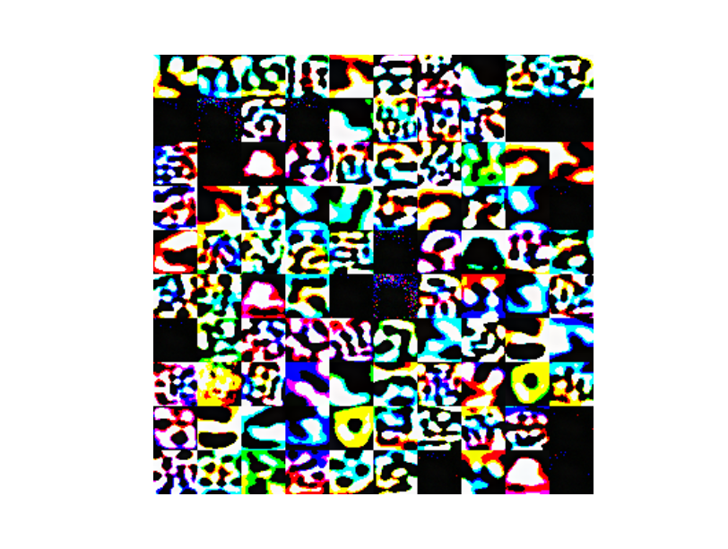

sent140
=======

Stacked autoencoder with noise and sparse penalties. Usual layer-wise pretraining and fine tuning. It requires cudamat package.

Example of learned features on *raw* images of cifar-10 (cute but mostly useless).




Usage
-----

Pretraining using l0.bin, l1.bin activations.
```bash
python pretrain.py -f l0.bin -a l1.bin -o l0.par -l 0.1 -x 1000 -b 700 -e 60
python pretrain.py -f l1.bin -a l2.bin -o l1.par -l 0.1 -x 500 -b 700 -e 60
```

Create the full model.
```bash
cat l0.par l1.par > l01.par
```

Fine tune.
```bash
python tune.py -f l0.bin -d corpus.bin -o l01.par -l 0.01 -b 700 -e 60
```

